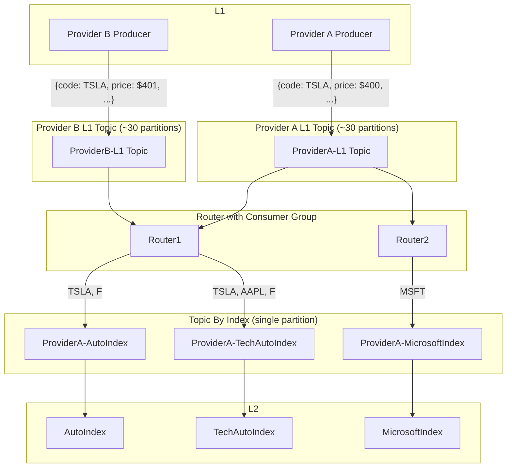

- Stretch cluster deployments for multiple clients with 2.5 DC KRaft + CP 8.1 upgrade with RBAC
- Government client engagement: E2E encryption using Kafka Streams over cloud KMS
- GlobalBank engagement: multi DC cluster setup using Ansible, performance tuning
- FinanceCo engagement: PoC for Kafka client implementing their interface. Target: 90k producer messages/s (write amplification to 2.5m messages/s via fan-out). E2E latency 50-100ms target
	- Context
		- Stock price updates arrive in 9 different streams (different market + provider). Peak traffic: 45k updates/s across all 9 streams. Target: 90k updates/s
		- 400 indices. 400 JVM processes consuming stock updates and calculating index values
	- Why
		- Replace existing UDP-based message hub with Kafka
		- PoC needed with existing interface, handling peak load (2x current maximum) with E2E 100ms latency
	- What + Scope
		- Build PoC using Kafka to replace current hub achieving 100ms E2E latency for 90k updates/s
			- 100ms is forgiving — not extreme low latency. For extreme low latency, Kafka is not suitable (LMAX disruptor would be more appropriate)
		- L1 (market data capture) → L2 (index calculation), no resilience required for PoC
		- L2 has source switching logic (if primary provider fails, failover to secondary)
		- Stock update is 55 bytes (~5Mbps produced)
			- Storage if kept for 7 days: `5Mbps * 3600 * 24 * 7 = 3TB`
			- Storage for 10 hours of market capture: `5Mbps * 3600 * 10 = 180GB`
		- Data loss acceptable, replication factor not required — helps with performance
		- Challenges (hard constraints)
			- Existing interface method is a hard requirement — single topic subscriber
			- Fixed number of topics
	- Proposed designs
		- Router approach (27x write amplification)
			- Maintain index mapping in router
			- Only 1 extra component
			- Index topics can be single partition with compaction
			- 90k msg/s → 2.5m msg/s; 5MB/s → 150MB/s egress
			- Storage roughly constant due to compaction
		- Single topic per stock/source
			- Number of topics not fixed — new stock = new topic
			- Hard constraint on single topic subscriber creates unnecessary connections (e.g. 200 connections for 200 stocks instead of 1)
		- Single topic for all updates
			- Simplest, but unnecessary consumption problem persists
		- Shard by stock code with large number of partitions
			- Hot spot / imbalanced partitions
			- Requires shared partitioner logic (version must match on both producer and consumer)
	- Works
		- Spun up servers using Terraform + Ansible cluster deployment
		- Deployed 9 producers + 400 consumers, performed load test
		- Tuned broker + client settings, heap size, router batching/linger/buffer
		- Tweaked router to use byte array, skip Kafka SerDe
	- Result
		- Single topic approach: 1.6GB/s egress and heavy broker CPU (all 400 consumers on same topic)
		- Router approach: Network drop to 5MB/s, write amplified to 150MB/s, but network saving is significant. Achieved E2E latency 40-120ms at 2x peak load
- Deployed Confluent Platform on Kubernetes/OpenShift

Simplified diagram for FinanceCo PoC

