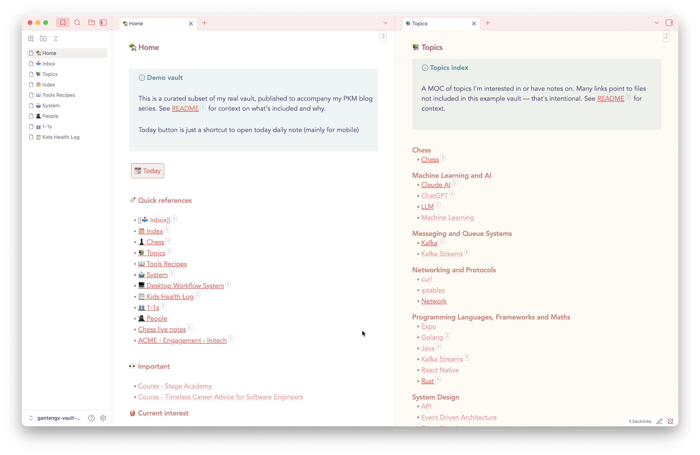

Date: [[2026-03-01]]
Published: [[2026-02-28]]
Subtitle: How I set up Obsidian to support my PKM system, with minimal plugins and no folders
SEO Description: My minimal Obsidian setup: flat file structure, four core plugins, Bases for inbox, and a CLAUDE.md for AI-assisted note work.
Tags: obsidian, pkm, productivity, knowledge management

---

This post is the implementation side of my previous posts about my PKM system. The principles work in any plain-text tool but I used Obsidian and this is how I set it up. The example vault is [on GitHub](https://github.com/ronaldsuwandi/gantengx-vault-example) if you want to explore it directly.


## Why Obsidian
A few reasons:

- Plain markdown files on your machine. No proprietary format, no vendor lock-in, no subscription required to access your own writing.
- Offline-first. Everything works without a connection. Obsidian Sync handles mobile sync cleanly when you need it.

I came from Roam Research. Some ideas carried over: daily notes as scratchpad, bidirectional links and flat file structure without folders. But the tool itself didn't stick and the pricing was hard to justify for my use.

Worth naming the contrast with Notion too. Notion is a product that wants you to spend time inside it: databases, views, templates all invite configuration. Obsidian mostly stays out of the way.

## Theme: Minimal
I use the [Minimal theme](https://minimal.guide) with its companion settings plugin. The name is accurate. It strips back the visual chrome, improves typography, and keeps the focus on the content. I've turned off most of the optional visual styles and left it close to its defaults.

Honestly I feel that Minimal theme should be the default theme.

## File naming in practice
Everything lives flat with naming conventions instead of folders. I don't use the file explorer at all. The quick switcher is the primary way I navigate. I chose a flat structure because it means I never have to decide where to put a file at the point of capture.

A few examples of how prefixes look in practice:

```
Log - 1-1 - Manager 1
Log - Health - 2026-01-03 - Child 1 - Fever
Course - Agent Skills with Anthropic
ACME - Engagement - Globex
```

The prefix does the work that folders would otherwise do, without requiring a categorisation decision upfront.

## Core plugins
Four plugins earn their place. Everything else is optional or absent.

**QuickSwitcher++** replaces the built-in quick switcher with a more capable version. The search is more powerful and you can search by heading, not only filename.

**Natural Language Date** is very useful as you can type `today` or `3 jan` inside a note and it converts it to a proper date link. I mostly use this for referencing daily notes quickly.

**QuickAdd** is used to create a note combined with the template. Keeping to simplicity I only used this to help create new entry for 1-1 or my kids log health record as they got new illness

**Button Maker** creates clickable buttons that trigger QuickAdd macros. I use this in my health log template so I can create a new entry with a single click.

## Optional plugins
These are utilities I reach for occasionally, not regularly:

- **Strange New Worlds**: shows inline, next to any link, how many other notes reference the same thing. Useful for getting a quick sense of how connected a note is without opening the backlinks panel.
- **Note Refactor**: extract a section of a note into its own file. Useful when a note outgrows itself and a section is ready to become an evergreen note.
- **Bulk Rename**: batch rename files. Mostly useful when a naming convention changes.
- **Sort & Permute Lines**: alphabetically sort a list. Occasional use in reference notes.
- **Collapsible Code Blocks** and **Copy as HTML**: quality-of-life for specific contexts (the latter useful when publishing content).

## Daily notes and inbox
Daily notes are my scratchpad. The rule: every daily note should be empty. A non-empty daily note means something is unprocessed.

`📥 Inbox.md` surfaces these: any daily notes with content, plus notes tagged `#todo`. I used Dataview for this query until Obsidian shipped [Bases](https://help.obsidian.md/bases) as a core plugin. Same result, one less community plugin to maintain.

## What's not here
**Graph view**: Visually impressive, practically useless. Local graph is somewhat more useful but honestly I only use it a few times at the start and never again.

**Dataview**: Replaced by Bases for my inbox use case. See above.

## Claude Code integration
The `CLAUDE.md` included in the vault is the actual prompt I use. It defines the vault structure, note taxonomy, and naming conventions. It provides enough context for Claude to act as a vault assistant without needing to be re-briefed each session. No extra skills configured. Keeping it simple is the point.

The full vault is [on GitHub](https://github.com/ronaldsuwandi/gantengx-vault-example).

---

*This is part 3 of a 3-part series. [[Post - The PKM Setup I Settled On After Many Iterations|Part 1]] covered the PKM system. [[Post - How I Capture Notes Using the 4 Bucket System|Part 2]] covered how I capture notes*
